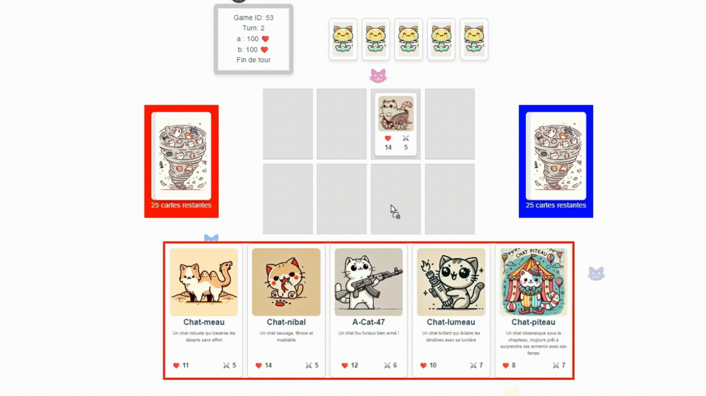

# Projet de Jeu de Cartes

## Description

## 🐾 **Cat-Aclysme** - Un Jeu de Cartes Dévastateur... Avec des Chats ! 🐾

Préparez-vous à l'affrontement ultime dans **Cat-Aclysme**, un jeu de cartes 1v1 où des félins armés jusqu'aux crocs s'affrontent pour la domination ! 🐱💥

Dans ce monde post-apocalyptique rempli de chats guerriers, chaque joueur construit son deck de **30 cartes** et tente d'anéantir son adversaire à coups de griffes, d'épées, et d'attaques surprises. 🐾⚔️

### ⚔️ **Gameplay** :
- 🃏 Piochez des cartes pour renforcer votre armée féline
- 🛡️ Défendez vos **100 HP** en plaçant stratégiquement vos cartes sur le plateau
- 💣 Utilisez des combos dévastateurs et déjouez les plans de votre adversaire
- 👑 Le dernier joueur à avoir encore des HP est couronné maître du Cat-Aclysme !

### 🐱 **Fonctionnalités** :
- **30 cartes uniques** avec des personnages aussi mignons que dangereux
- Des mécaniques simples mais stratégiques
- **Design en C# et Vue.js** pour une expérience fluide et captivante
- Des illustrations de cartes adorables et drôles dans un style doodle



## Stack Technologique

- **Backend** : .NET Core, Entity Framework Core, SQL Server Express
- **Frontend** : Vue.js
- **Base de Données** : SQL Server Express

## Prérequis

- [.NET SDK](https://dotnet.microsoft.com/download) (version 6.0 ou ultérieure)
- [SQL Server Express](https://www.microsoft.com/en-us/sql-server/sql-server-downloads)
- [SQL Server Management Studio (SSMS)](https://learn.microsoft.com/en-us/sql/ssms/download-sql-server-management-studio-ssms)
- [Node.js et npm](https://nodejs.org/)
- [Vue CLI](https://cli.vuejs.org/) 

## Installation

### Backend

1. **Clonez le dépôt :**

   ```bash
   git clone https://github.com/Kylas07/cat-aclysme.git
   cd repo
   ```

2. **Naviguez vers le répertoire du backend :**

   ```bash
   cd back-end
   ```

3. **Restaurez les dépendances .NET :**

   ```bash
   dotnet restore
   ```

4. **Créez la base de données :**

- Utilisez le script dans `CatAclysmeBDD.sql` pour créer la base de données.


5. **Appliquez les migrations Entity Framework Core :**

   ```bash
   dotnet ef database update
   ```

6. **Exécutez l'application backend :**

   ```bash
   dotnet run
   ```

### Frontend

1. **Naviguez vers le répertoire du frontend :**

   ```bash
   cd front-end
   ```

2. **Installez les dépendances Node.js :**

   ```bash
   npm install
   ```

4. **Installez Axios pour les appels API :**

   ```bash
   npm install axios
   ```

4. **Exécutez l'application frontend :**

   ```bash
   npm run serve
   ```

## Configuration

### Configuration du Backend

- Modifiez `appsettings.json` pour configurer la chaîne de connexion à la base de données :

  ```json
  "ConnectionStrings": {
    "DefaultConnection": "Server=localhost\\SQLEXPRESS;Database=CatAclysmeDB;Trusted_Connection=True;"
  }
  ```

### Configuration du Frontend


## Utilisation

1. **Accéder à l'API Backend** :
   - Ouvrez un navigateur web ou un client API et aller à `http://localhost:5000/api/`.

2. **Accéder à l'application Frontend** :
   - Ouvrez un navigateur web et aller à `http://localhost:8080`.

